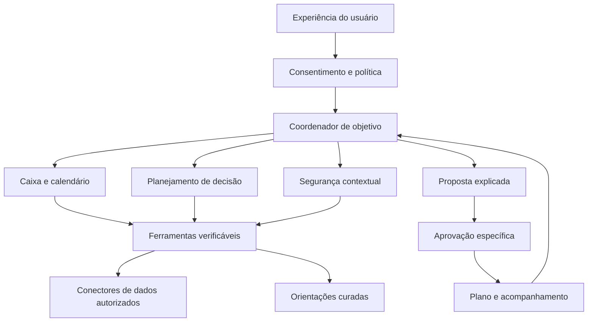
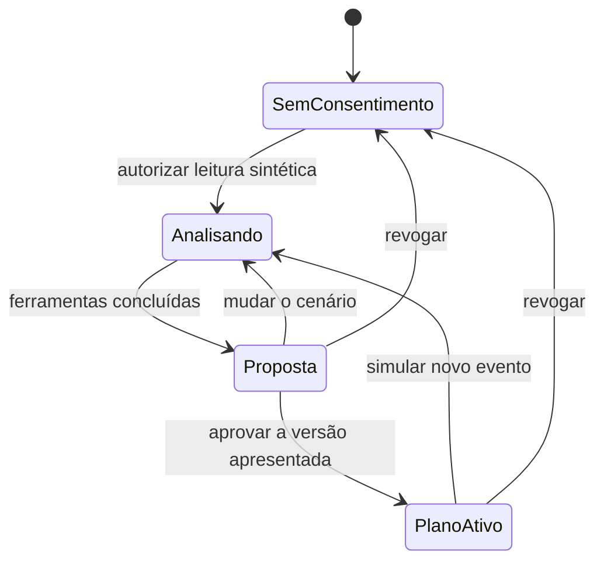

# Arquitetura e comportamento do agente

## Arquitetura alvo



O diagrama representa o desenho do produto, não três LLMs implantados. No protótipo, os papéis especializados são funções de domínio sob um coordenador. Isso permite testar a jornada sem criar uma arquitetura distribuída prematuramente.

## Responsabilidades

| Papel | Conhece | Decide ou produz | Ferramenta inicial |
| --- | --- | --- | --- |
| Coordenador | Objetivo, permissões e estado da jornada | Seleção limitada de ferramentas; síntese de ações | `build_report` e planejador opcional |
| Caixa | Saldo e eventos futuros | Projeção, menor saldo e distância da margem | `cashflow` |
| Planejamento | Preço, parcelas e compromissos | Impactos comparáveis e meta | `purchase`, `apply_saving` |
| Segurança | Sinais explicitamente fornecidos | Alerta ilustrativo e motivos | `safety` |
| Conhecimento | Conteúdo curado com origem | Orientação contextual | `guidance` |
| Política | Consentimento, snapshot e ações permitidas | Permite ou rejeita execução demonstrativa | `DemoSession.approve` |

## Fluxo implementado



O rastreamento mostra nome de ferramenta, papel e resultado da execução. Não divulga raciocínio interno de modelos. Em produção, cada chamada terá ID de correlação, origem, data, versão da política e resultado, com minimização de informações.

## IBM: papéis diferentes

**IBM Bob:** ferramenta de desenvolvimento utilizada pela equipe para construir, revisar e testar a solução. Não é o agente financeiro que atende o usuário. O guia exige seu uso central e evidências no repositório. Esta preparação não comprova que o Bob foi utilizado.

**IBM watsonx.ai + Granite:** o adaptador opcional autentica no IAM e solicita a seleção das ferramentas permitidas. Os valores financeiros vêm do código. O ID do modelo é configurado com base na disponibilidade real da conta; não presumimos acesso a uma versão.

**IBM watsonx Orchestrate:** alternativa recomendada para a orquestração alvo. A equipe pode importar ferramentas e implementar os papéis no ambiente provisionado. Não há configuração Orchestrate implantada neste repositório.

O guia do lab trata Bob como obrigatório e as outras tecnologias como opcionais/recomendadas; o documento de desafios também orienta o uso de watsonx para a POC. Para atender às duas orientações, o plano inclui validar watsonx/Granite e confirmar com o mentor a expectativa da trilha.

## Contrato do planejador

Entrada: objetivo representado pelo cenário sintético, datas, compromissos e presença de compra ou intenção de PIX. Saída esperada:

```json
{"tools": ["cashflow", "guidance"]}
```

Há no máximo quatro ferramentas. Nomes desconhecidos são rejeitados pelo adaptador. A política acrescenta caixa e análises obrigatórias de compra/PIX quando aplicável. O modelo não chama shell, não escolhe URLs e não executa operações financeiras. Em falha, a interface identifica o modo determinístico de contingência.

Isso valida um primeiro componente agêntico de seleção de ferramentas; ainda não constitui planejamento aberto, negociação entre múltiplos modelos ou raciocínio financeiro generativo completo. Para a entrega, avaliar escolhas de ferramenta, adequação da ação e recuperação de falhas em casos inéditos.

## Números, calendário e limites

- Valores monetários são inteiros em centavos, nunca ponto flutuante.
- Compromissos essenciais não são reduzidos pela ferramenta de orçamento.
- Reduções atingem somente saídas futuras marcadas como flexíveis.
- Recebimentos esperados não são garantidos. O protótipo usa datas fixas de cenário.
- Eventos do mesmo dia são agregados; não há modelagem de liquidez intradiária.
- A compra à vista é considerada hoje. No exemplo parcelado, só a primeira parcela entra no horizonte; as demais precisam de uma projeção longa antes de recomendar a contratação.
- A redução completa de lazer do exemplo é uma opção ilustrativa. Em produção, o usuário ajustará o limite e o sistema poderá apresentar um resultado parcial.

## Dados e integrações

No lab, todos os dados são sintéticos e não há formulário para extratos, dados pessoais ou chaves bancárias.

A arquitetura de produção poderia utilizar dados internos do BB e de outras instituições mediante consentimento e integração com participantes autorizados do Open Finance. Compartilhamento de dados não significa autorização para pagamento e não oferece, por si só, acesso garantido em tempo real a uma intenção de PIX.

Um alerta pré-pagamento depende de um ponto de integração específico na jornada transacional do banco. O protótipo recebe uma intenção fictícia fornecida pelo cenário; não intercepta o app BB nem monitora outros aplicativos.

## Persistência e autorização

Cada navegador recebe uma sessão demonstrativa independente. Um hash do snapshot identifica o contexto apresentado. A execução compara esse identificador com o relatório atual, verifica o consentimento e aplica somente o efeito permitido no servidor. Uma repetição da mesma aprovação não duplica o efeito.

Revogar a leitura oculta a análise e limpa os planos da sessão. O servidor não grava dados em disco. A sessão demonstrativa não substitui identidade, consentimento jurídico, auditoria ou proteção de produção.

Em produção: identidade do cliente validada pelo banco, escopos e expiração de consentimento, revogação efetiva, autenticação reforçada para operações sensíveis, idempotência, confirmação de valores, autorização transacional separada, trilha de auditoria e tratamento de falhas dos conectores.

## Conteúdo e RAG

`data/knowledge.json` contém uma pequena base curada consultada por tópico. Não é um mecanismo vetorial de RAG. A evolução deverá indexar documentos oficialmente permitidos, registrar URL, versão, data de consulta e validade, e responder com trechos recuperados e fontes.

Sem fonte atual ou em caso de conflito, o agente informa que não consegue confirmar a condição e encaminha ao canal adequado. FGTS, crédito e investimentos não entram como respostas jurídicas/financeiras presumidas.

## Escala proposta

Separar API, fila de eventos, workers, armazenamento e conectores em uma etapa posterior. Cache de ferramentas respeitará revogação e validade dos dados. Alertas serão deduplicados e priorizados por relevância para evitar fadiga. Nenhuma capacidade de escala foi medida na base local atual.
